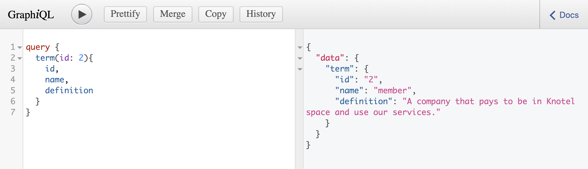

This project was bootstrapped with [Create React App](https://github.com/facebook/create-react-app).

## Spin Up a Project from Scratch

* **[Getting Started](#getting-started):** Setting up React boilerplate.
* **[Installing Dependencies](#installing-dependencies):** Install dependencies for the frontend, backend and ApolloClient.
* **[Create GraphQL Server](#create-graphql-server):** Create Express server.
* **[ApolloClient Setup](#apolloclient-setup):** Create Instance of ApolloClient.
* **[Connect Frontend to Backend](#connect-frontend-to-backend):** Connect React to GraphQL Server Using ApolloClient.

### `Getting Started`

Today we will be building a glossary of terms frequently used at Knotel.

#### React Setup with create-react-app

First, let's create the React app by initiating a new basic React project in the newly created project folder knotel_glossary.

```bash
$ npm init react-app knotel_glossary
$ cd knotel_glossary
```
Inside the `package.json` file, you will see several scripts have been provided that allow you to run several commands from Terminal: `react`, `react-dom` and `react-scripts`. 

To start up the application, in the Terminal type:

```bash
$ npm start. #Starts the development server.
```

By using the `npm start` command the live-reloading development web server is started and you can now view knotel_glossary in the browser:

```bash
  Local:            http://localhost:3000/
  On Your Network:  http://10.0.80.246:3000/
```
#### React Setup with Parcel


#### Setting Up Folder Structure

In the `src` folder, add the following folders:

```bash
$ mkdir src/assets
$ mkdir src/components
$ mkdir src/services
```
The `assets` folder is where we will maintain images and videos to be used in the application.

```md
└── src
    ├── assets
        ├── images
        ├── videos
```
The `components` folder is where we will set up our component file structure.

```md
└── src
    ├── components
    │   ├── List
    │       ├── List.js
    │       ├── List.css
    │   ├── ListItem
    │       ├── ListItem.js
    │       ├── ListItem.css

```

The `services` folder is where we will make our api calls.

```md
└── src
    ├── services
        ├── apiservices.js
```

#### File Structure

The `src` folder contains the core business logic of our React application. Ultimately, the project folder structure should look similar to the following:

*Note: We are using the .jsx extension because the components are not standard JavaScript and we want to maintain a pattern where JavaScript goes in .js files.*

#### House Cleaning

Now, let’s do some house cleaning:

In the src folder, delete the following files:

```bash
$ rm serviceWorker.js
$ rm logo.svg
```
Then, in the `index.js` file, delete all references to serviceWorker and in the `src/App.js`, delete the line that imports the logo.

#### Hello Hello

Now, modify the App Component to reflect the following changes in the `return()`.
The `src/App.js` file should look similar to the following:

```js
import React, { Component } from 'react';

class App extends Component {
  render() {
    return (
      <div className="App">
        <h1>Hello Hello</h1>
      </div>
    );
  }
}

export default App;
```
Our frontend environment is set up and now you’re ready to move on!

### `Install Dependencies`

Before we get our server up and running, we'll need to install a few dependencies:

#### Frontend
Install Knotel’s Design System, [Cinderblock](https://github.com/knotel/cinderblock):

```bash
$ npm install @knotel/cinderblock
```
#### Backend

Install the following dependencies:

```bash
$ npm install cors express express-graphql
```

* [cors](https://expressjs.com/en/resources/middleware/cors.html): This simple use of cors enables all Cross-Origin Resource Sharing (CORS) requests.
* [express](https://github.com/expressjs/express): minimalist web framework for Node.
* [express-graphql](https://github.com/graphql/express-graphql): Create a GraphQL HTTP server with Express.

#### ApolloClient

Install the following dependencies:

```bash
$ npm install apollo-boost react-apollo graphql graphql-tag
```

* [apollo-boost](): Package containing everything you need to set up Apollo Client
* [react-apollo](): View layer integration for React
* [graphql-tag](): Necessary for parsing your GraphQL queries
* [graphql](): Also parses your GraphQL queries

### `Create GraphQL Server`

#### Setting Up Express

Create a new directory in the `src` folder named `server`. In that folder, create an `index.js` file which will be the starting point for the backend:

```bash
$ mkdir src/server
$ cd server
$ touch index.js
```
Once you've created an `index.js`, import the backend dependencies, initialize the server with express command, then identify which port it should listen for requests:

```js
const express = require('express');
const graphqlHTTP = require('express-graphql');
const cors = require('cors'); 

const app = express();

const PORT = process.env.PORT || 4000

app.get('/', (req, res) => res.send('Hello Hello!'))

app.listen(PORT, () => console.log(`Knotel app listening on port ${PORT}!`))
```
This is simple boilerplate for an Express server that you can find in the documentation.

To make sure we can easily run both the server and client at the same time, add the following dev dependencies:

```bash
$ npm install nodemon npm-run-all
```
Then, edit the `package.json` with the following new scripts:

```js
{
    "start": "npm-run-all --parallel watch:server start:web",
    "start:web": "react-scripts start",
    "start:server": "node src/server",
    "watch:server": "nodemon --watch src/server src/server/index.js"
}
```
In Terminal, type `npm run start` to run both server and client simultaneously. This script uses the package [npm-run-all](https://www.npmjs.com/package/npm-run-all), a CLI tool to run multiple npm-scripts in parallel or sequential.

#### Setting Up GraphQL endpoint

Import the graphql package, and create a simple GraphQL schema using the buildSchema function. Then, create a resolver that maps actions to functions. In this case, the message function returns the string _Hello Hello!_. Finally, create the GraphQL endpoint using the `app.use` method and passing in the URL endpoint as a String and the result of the graphqlHTTP function. The three properties of the function are:

* schema: The GraphQL schema which should be attached to the specific endpoint
* rootValue: The root resolver object
* graphiql: Must be set to true to enable the GraphiQL tool when accessing the endpoint in the browser

```js
// import dependencies
const express = require('express');
const graphqlHTTP = require('express-graphql');
const { buildSchema } = require('graphql');

const PORT = 4000

// GraphQL schema
const schema = buildSchema(`
    type Query {
        message: String
    }
`);

// Root resolver
const root = {
    message: () => 'Hello Hello!'
};

// Create an express server and a GraphQL endpoint

const app = express();
const cors = require('cors'); 

app.use('/graphql', graphqlHTTP({
    schema: schema,
    rootValue: root,
    graphiql: true
}));

// start the server on port 4000
app.listen(PORT, () => console.log(`Knotel app listening on port ${PORT}!`))
```

Point your browser to `http://localhost:4000/graphql` to see results. In the query editor on the left type the following and press the play button:

```js
{
    message
}
```
You should see the following results in the right screen window:

```js
{
  "data": {
    "message": "Hello Hello"
  }
}
```


### `Using Mock Data`

For now, to be able to return data without the need to connect to a database let's use some mock data to query:

```js
const TERMS = [

  {
    id: 1,
    name: 'floor',
    definition: 'The base unit for what we deliver as a product. We build and fit a floor, not building, we put members on a floor.',
  },
  {
    id: 2,
    name: 'member',
    definition: 'A company that pays to be in Knotel space and use our services.',
  }

]
```
Here, you’ve defined a `Term` type, which contains an id, and name, and a definition. You need to say what the types are for each element. Here, name and definition both use the primitive String type, and id is an ID.

Here, you’re saying that terms will give you an array of Terms, but if you want a single Term you can query it by calling term and passing in the ID.

First we define a schema with a custom type `Term` and two query actions. The `Term` object type consist of three properties -- id, name and definition. The defined query actions enable the user to retrieve a single term by ID or retrieving an array of Term objects.

```js
const schema = buildSchema(`
    type Query {
        term(id: ID!): Term
        terms: [Term]
    }

    type Term {
        id: ID
        name: String
        definition: String
    }
`)
```

In the root resolver we’re connecting the `term` query action to the `getTerm()` function and the `terms` query action to the `getTerms()` function.

```js
// getTerm function
const getTerm = (term) => {
    console.log(term.id)
    let id = term.id
    return TERMS.filter(num => num.id == id).shift()
}

// getTerms function
const getTerms = (term) => {
    return TERMS.map(term => term) 
}

// root resolver
const root = {
    // terms query action
    terms: getTerms,
    // term query action
    term: getTerm
}
```
When someone queries `terms`, it will run the `getTerms()` function, providing an array of all the Terms, but if you want a single Term you can query it by calling term and passing in the ID.



### `ApolloClient Setup`

Connect the frontend (React application) to GraphQL (Express server). 

In order to be able to access a GraphQL service from our React application we need to create an instance of ApolloClient.

Create a new file in the `src` folder named `ApolloClient.js` and include the following:

```js
import ApolloClient from 'apollo-boost'

export default new ApolloClient({
    uri: "http://localhost:4000/graphql",
})
```
Here, ApolloClient is imported from the `apollo-boost` library. A new instance of ApolloClient is created and stored in the client variable.

Now, we need to connect the instance of ApolloClient to the React application in the `index.jsx`. To do this, we need to wrap the entire app in an ApolloProvider component.

```js
...
import { ApolloProvider } from 'react-apollo';
import App from './App';
import client from './ApolloClient';

ReactDOM.render(
    <ApolloProvider client={client}>
        <App />
    </ApolloProvider>, 
    document.getElementById('root')
);
```